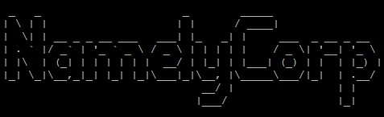
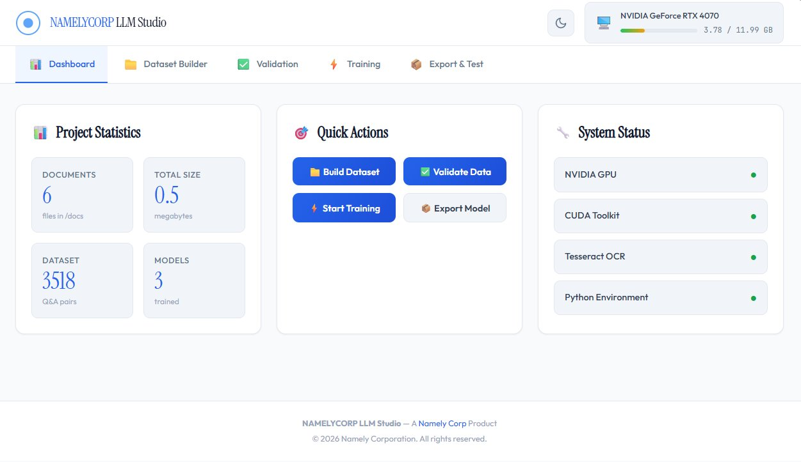
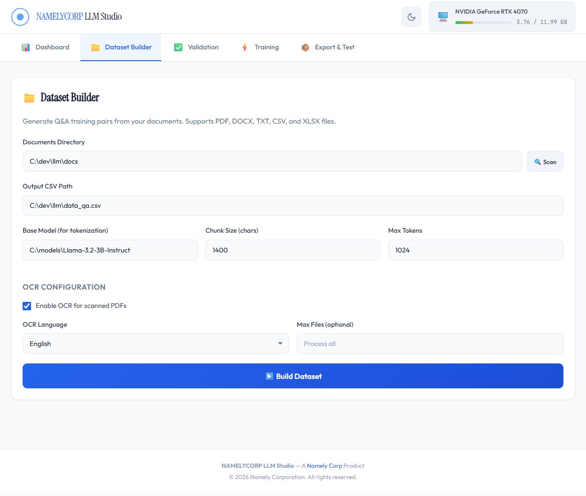
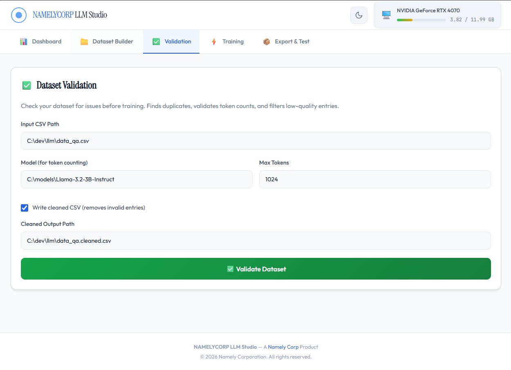
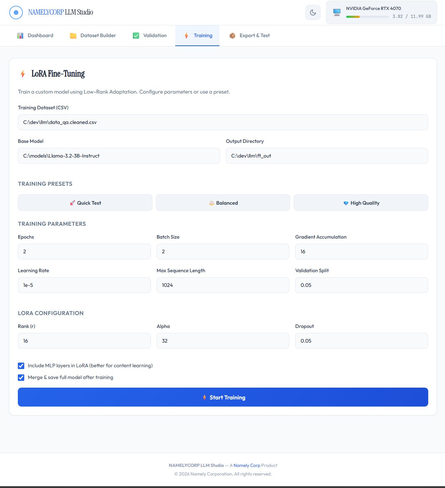

# NamelyCorp LLM Studio

<div align="center">
  
  <br/>
  <strong>Local-first LoRA fine-tuning Studio with web UI</strong>
  <br/>
  <em>Windows-first • No Docker required • Runs on your machine</em>
</div>

---

## Overview

NamelyCorp LLM Studio is an end-to-end system for building **document-grounded fine-tuned language models** using Low-Rank Adaptation (LoRA). It provides a complete workflow from document ingestion to deployable models—all running locally on your machine.

**Key Features:**
- 📄 **Dataset Builder** — Generate Q&A training pairs from PDF, DOCX, TXT, CSV, and XLSX files
- ✅ **Validation** — Check dataset quality, remove duplicates, validate token counts, and filter low-quality entries
- ⚡ **LoRA Training** — Fine-tune with masked loss (assistant tokens only), configurable parameters, and training presets
- 📦 **Export** — Save LoRA adapters, merge full models, optional GGUF conversion for llama.cpp
- 🧪 **Testing** — Smoke-test inference locally before deployment
- 🖥️ **Web UI** — Intuitive dashboard for the complete workflow with real-time GPU monitoring

> **Privacy:** This project is designed to run locally. No telemetry is included. Your documents and training data stay on your machine unless you choose to share them.

---

## Screenshots

### Dashboard

*Overview with project statistics, quick actions, and system status monitoring*

### Dataset Builder

*Generate Q&A pairs from your documents with OCR support*

### Validation

*Clean and validate your training data*

### Training

*LoRA fine-tuning with configurable parameters and presets*

---

## Who This Is For

- ML engineers and technical practitioners
- Developers training models on **their own documents**
- Teams who want **repeatable, auditable fine-tuning** workflows
- Windows users with NVIDIA GPUs (RTX 30/40 series recommended)

This is **not** a hosted service and does **not** include base model weights or trained artifacts.

---

## Prerequisites

### Required
- **Operating System:** Windows 11 recommended (Windows 10 also supported)
- **Python:** Python 3.11 (Python launcher `py` must be in PATH)
- **Disk Space:** 50GB+ recommended (for models, datasets, and outputs)

### Recommended
- **GPU:** NVIDIA GPU with CUDA support (RTX 3060 or higher recommended)
  - RTX 30/40 series with 8GB+ VRAM strongly recommended
  - CPU-only training is possible but very slow
- **CUDA Drivers:** CUDA 12.1 compatible drivers
- **RAM:** 16GB+ system memory

### Optional
- **Tesseract OCR:** For processing scanned PDFs
  - Download from: https://github.com/UB-Mannheim/tesseract/wiki
  - Add to PATH after installation

---

## Quick Start

### Step 1: Clone the Repository
```bash
git clone https://github.com/NamelyCorp/NamelyCorp-LLM-Studio.git
cd NamelyCorp-LLM-Studio
```

### Step 2: Set Up Python Environment
Run the setup script to create a virtual environment and install core dependencies (including CUDA PyTorch):

```bat
setup_llm.bat
```

This will:
- Create `.venv` with Python 3.11
- Install CUDA 12.1 PyTorch and core libraries
- Install document processing and OCR dependencies
- Create a `docs/` folder for your documents

### Step 3: Activate Virtual Environment
PowerShell:
```powershell
.\.venv\Scripts\Activate.ps1
```

Command Prompt:
```bat
.venv\Scripts\activate.bat
```

### Step 4: Login to Hugging Face (if using gated models)
```bash
huggingface-cli login
```

### Step 5: Set Up and Launch Studio UI
```bat
cd studio
setup_studio.bat
launch_studio.bat
```

The Studio UI will be available at: **http://localhost:7860**

---

## Using the Studio

### Workflow Overview

The Studio guides you through a complete fine-tuning pipeline:

1. **Dashboard** — View project statistics, system status, and quick actions
2. **Dataset Builder** — Generate Q&A pairs from your documents
3. **Validation** — Clean and validate your training data
4. **Training** — Fine-tune with LoRA using configurable parameters
5. **Export & Test** — Export adapters, merge models, convert to GGUF, and test inference

### UI Tab Reference

#### Dashboard
- **Project Statistics:** Document count, dataset size, trained models
- **Quick Actions:** One-click shortcuts to common tasks
- **System Status:** Real-time GPU monitoring, CUDA toolkit status, Tesseract OCR availability, Python environment

#### Dataset Builder
Generate Q&A training pairs from your source documents.

**Supported Input Formats:**
- PDF (with optional OCR for scanned documents)
- DOCX (Microsoft Word)
- TXT (plain text)
- CSV (comma-separated values)
- XLSX (Microsoft Excel)

**Configuration:**
- **Documents Directory:** Path to your source documents
- **Output CSV Path:** Where to save the generated dataset
- **Base Model:** Model to use for tokenization
- **Chunk Size:** Characters per document chunk (default: 1400)
- **Max Tokens:** Maximum token length (default: 1024)
- **OCR Configuration:** Enable for scanned PDFs, select language

**Process:**
1. Place your documents in the `docs/` folder
2. Configure parameters in the UI
3. Click "Build Dataset"
4. Generated dataset is saved as CSV with `question` and `answer` columns

#### Validation
Check dataset quality and optionally clean problematic entries.

**Validations Performed:**
- Header validation (correct column names)
- Duplicate detection (exact duplicates)
- Token count validation (within max_tokens limit)
- Low-quality entry detection (very short or malformed content)

**Configuration:**
- **Input CSV Path:** Dataset to validate
- **Model:** Model to use for token counting
- **Max Tokens:** Token limit for validation
- **Write Cleaned CSV:** Optionally output cleaned dataset
- **Cleaned Output Path:** Where to save the cleaned dataset

**Output:** 
- Markdown report with statistics and issues found
- Optional cleaned CSV with invalid entries removed

#### Training
Fine-tune your model using LoRA (Low-Rank Adaptation).

**Training Presets:**
- **Quick Test:** Fast training with minimal resources (2 epochs, batch size 2)
- **Balanced:** Good balance of quality and speed (default settings)
- **High Quality:** More thorough training for production use

**Training Parameters:**
- **Epochs:** Number of training passes through the data
- **Batch Size:** Samples per batch
- **Gradient Accumulation:** Steps to accumulate gradients (effective batch = batch_size × grad_accum)
- **Learning Rate:** Step size for optimization (default: 1e-5)
- **Max Sequence Length:** Maximum token length

**LoRA Configuration:**
- **Rank (r):** LoRA rank parameter (default: 16)
- **Alpha:** LoRA alpha scaling (default: 32)
- **Dropout:** LoRA dropout rate (default: 0.05)
- **Include MLP layers:** Target both attention and MLP layers (recommended for content learning)

**Post-Training:**
- **Merge & save full model:** Combine LoRA adapters with base model for standalone deployment
- Output directory contains both adapters and merged model (if enabled)

#### Export & Test
Export trained models and test inference.

**Export Options:**
- **LoRA Adapters:** Lightweight adapter files (~100MB)
- **Merged Full Model:** Combined base model + adapters (~7GB for 3B models)
- **GGUF Conversion:** Convert to GGUF format for llama.cpp/CPU inference

**Testing:**
- Run quick inference tests to verify model quality
- Test on sample questions from your domain

---

## Command-Line Usage (Advanced)

For automation or scripting, all functionality is available via command-line scripts:

### Build Dataset
```bash
python make_dataset_from_docs.py
```

Configuration is in the script. Edit paths for your setup.

### Validate Dataset
```bash
python validate_qa.py --write-clean data_qa.cleaned.csv --report qa_report.md
```

### Train Model
```bash
python train_ft.py --merge-full
```

**Common Training Options:**
```bash
python train_ft.py \
  --csv data_qa.cleaned.csv \
  --model "C:\models\Llama-3.2-3B-Instruct" \
  --output-dir ft_out \
  --epochs 3 \
  --batch-size 2 \
  --grad-accum 16 \
  --learning-rate 1e-5 \
  --lora-r 16 \
  --lora-alpha 32 \
  --merge-full
```

### Test Inference
```bash
python test_inference.py
```

Outputs are written to `ft_out/` directory (adapters, merged models, logs).

---

## What's NOT Included

This repository intentionally does **not** include:

- **Base Model Weights:** You must download base models separately (e.g., Llama 3.2 from Hugging Face)
- **Training Data:** You must provide your own documents
- **Trained Adapters/Models:** No pre-trained fine-tuned models are included
- **Model Licenses:** You are responsible for complying with base model licenses (e.g., Meta LLaMA)

**Why?**
- Base models are typically 5-10GB+ and subject to their own licenses
- Training data is domain-specific and private to your use case
- This keeps the repository lightweight and license-compliant

---

## Why LoRA Fine-Tuning?

**LoRA (Low-Rank Adaptation)** is an efficient fine-tuning method that:
- Updates only ~0.1-1% of model parameters (vs. 100% in full fine-tuning)
- Requires significantly less memory and training time
- Produces lightweight adapter files (~100MB vs. multi-GB full models)
- Can be merged back into the base model for standalone deployment

**When to use LoRA fine-tuning:**
- You have domain-specific documents (policies, FAQs, technical docs)
- You want the model to answer from your content authoritatively
- You need reproducible, auditable training workflows

**LoRA vs. RAG (Retrieval-Augmented Generation):**
- **RAG:** Retrieves relevant documents at inference time; good for large, changing knowledge bases
- **LoRA:** Embeds knowledge directly in model weights; good for stable, authoritative content
- **Use both:** RAG for broad context, LoRA for domain expertise and style

---

## LAN Access Feature

The Studio UI server can be accessed from other devices on your local network—this is **intentional** and useful for:
- Monitoring training progress from another computer
- Mobile access to check GPU status
- Team development environments

**Security Note:** The server runs on `localhost:7860` by default. To enable LAN access, you would need to explicitly bind to `0.0.0.0`, but **DO NOT expose this to the public internet without:**
- Authentication/authorization
- TLS/HTTPS encryption
- Firewall allowlist rules
- Network isolation

See [SECURITY.md](SECURITY.md) for detailed security guidance.

---

## Troubleshooting

### CUDA Issues

**Problem:** "CUDA not available" or GPU not detected

**Solutions:**
- Verify NVIDIA drivers are installed: `nvidia-smi` in terminal
- Reinstall CUDA-enabled PyTorch:
  ```bash
  pip install --force-reinstall torch torchvision torchaudio --index-url https://download.pytorch.org/whl/cu121
  ```
- Check CUDA version compatibility: https://pytorch.org/get-started/locally/

### OCR Missing

**Problem:** "Tesseract not found" error

**Solutions:**
- Install Tesseract: https://github.com/UB-Mannheim/tesseract/wiki
- Add Tesseract to PATH:
  - Default location: `C:\Program Files\Tesseract-OCR`
  - Add to system PATH in Windows settings
- Verify installation: `tesseract --version` in terminal

### Port Conflicts

**Problem:** "Address already in use" when launching Studio

**Solutions:**
- Check if port 7860 is in use: `netstat -ano | findstr :7860`
- Kill the process using the port or choose a different port
- Edit `studio/app.py` to change the port (search for `7860`)

### Out of Memory (OOM)

**Problem:** Training crashes with CUDA out of memory error

**Solutions:**
- Reduce batch size (try 1)
- Increase gradient accumulation steps (try 32 or 64)
- Reduce max sequence length (try 512 or 768)
- Use a smaller base model (e.g., 1B instead of 3B)
- Enable gradient checkpointing (enabled by default in `train_ft.py`)

### Import Errors

**Problem:** "ModuleNotFoundError" when running scripts

**Solutions:**
- Ensure virtual environment is activated:
  ```powershell
  .\.venv\Scripts\Activate.ps1
  ```
- Reinstall dependencies:
  ```bash
  pip install -r requirements.txt
  ```
- For Studio UI, run `studio/setup_studio.bat` again

### Dataset Issues

**Problem:** Validation fails or training produces poor results

**Solutions:**
- Check dataset format: Must have `question` and `answer` columns
- Remove duplicates: Use validation tab with "Write cleaned CSV" enabled
- Verify encoding: Save CSV as UTF-8
- Check content quality: Remove very short or nonsensical entries
- Increase dataset size: Aim for 100+ quality Q&A pairs minimum

---

## Repository Contents

```
NamelyCorp-LLM-Studio/
├── setup_llm.bat              # One-shot environment setup (core dependencies)
├── make_dataset_from_docs.py  # Generate Q&A dataset from documents
├── validate_qa.py             # Validate and clean datasets
├── train_ft.py                # LoRA fine-tuning script
├── test_inference.py          # Test model inference
├── requirements.txt           # Python dependencies
├── studio/                    # Web UI application
│   ├── app.py                # FastAPI backend server
│   ├── setup_studio.bat      # UI dependencies setup
│   ├── launch_studio.bat     # Launch Studio server
│   └── static/               # Frontend assets
│       ├── index.html        # Main UI
│       ├── app.js            # Frontend logic
│       ├── style.css         # Styling
│       └── logo.svg          # NamelyCorp logo
├── assets/                    # Documentation screenshots
├── docs/                      # Place your documents here (created by setup)
├── ft_out/                    # Training outputs (created during training)
├── LICENSE                    # MIT License
├── SECURITY.md               # Security policy and best practices
└── README.md                 # This file
```

---

## Contributing

Contributions are welcome! Please see [CONTRIBUTING.md](CONTRIBUTING.md) for guidelines.

**Areas for Contribution:**
- Additional document format support
- More training presets
- UI/UX improvements
- Documentation and tutorials
- Bug fixes and testing

---

## Responsible Use

- **Only train on documents you have the right to use**
- Do not include personal, confidential, or regulated data unless you have proper controls
- Respect base model licenses (e.g., Meta LLaMA, Mistral)
- Review exports before sharing—trained models can encode sensitive patterns
- Do not upload trained artifacts publicly unless you are sure your dataset is safe to disclose

---

## License

This project is licensed under the MIT License. See [LICENSE](LICENSE) for details.

**Important:** This license applies to the NamelyCorp LLM Studio software only. Base models you use (e.g., Llama 3.2) are subject to their own licenses. You are responsible for compliance with all applicable licenses.

---

## Security

See [SECURITY.md](SECURITY.md) for security policy, reporting vulnerabilities, and best practices.

---

## Support

- **Issues:** Report bugs or request features via GitHub Issues
- **Discussions:** Community support via GitHub Discussions
- **Documentation:** Check this README and inline documentation in scripts

---

## Acknowledgments

Built with:
- [PyTorch](https://pytorch.org/) - Deep learning framework
- [Transformers](https://huggingface.co/docs/transformers/) - Hugging Face Transformers library
- [PEFT](https://github.com/huggingface/peft) - Parameter-Efficient Fine-Tuning
- [FastAPI](https://fastapi.tiangolo.com/) - Web framework for Studio UI
- [Tesseract OCR](https://github.com/tesseract-ocr/tesseract) - Optical character recognition

---

<div align="center">
  <strong>NamelyCorp LLM Studio v1.0.0</strong>
  <br/>
  <em>© 2026 NamelyCorp. All rights reserved.</em>
</div>
